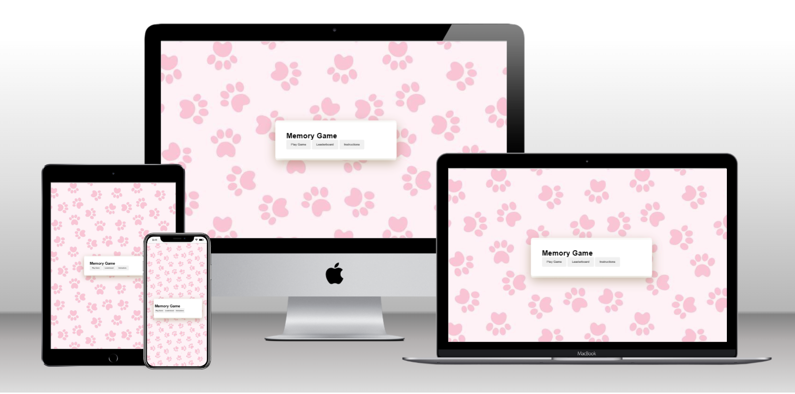
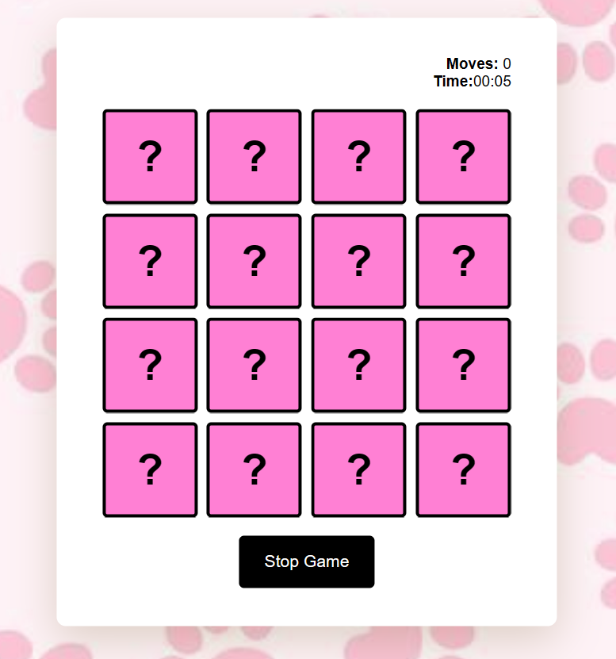
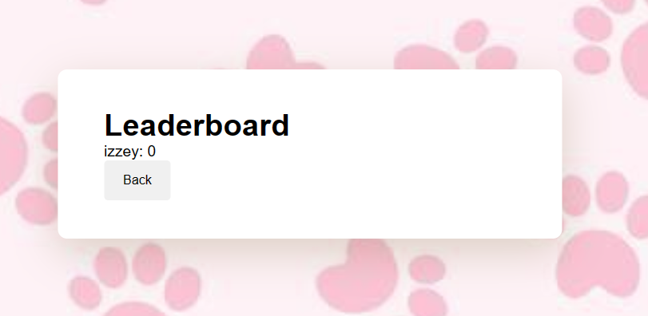
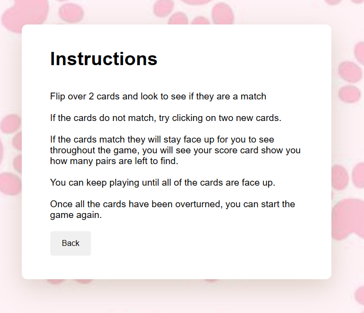
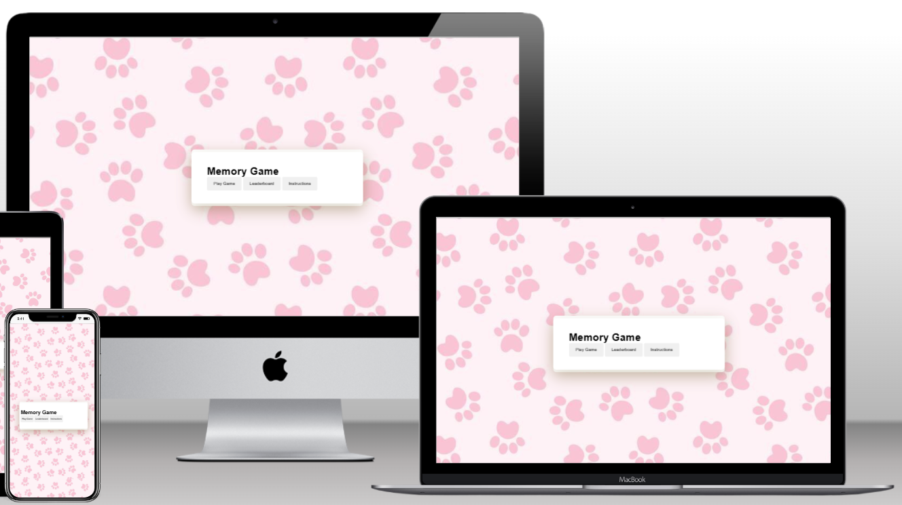
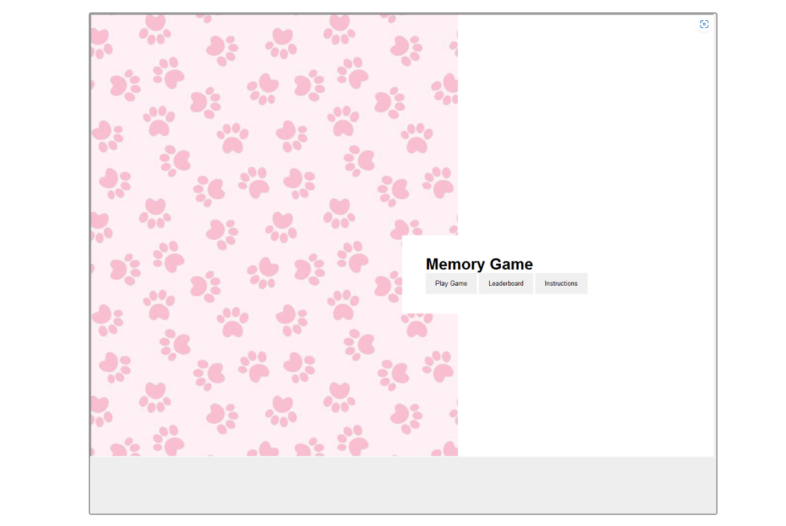
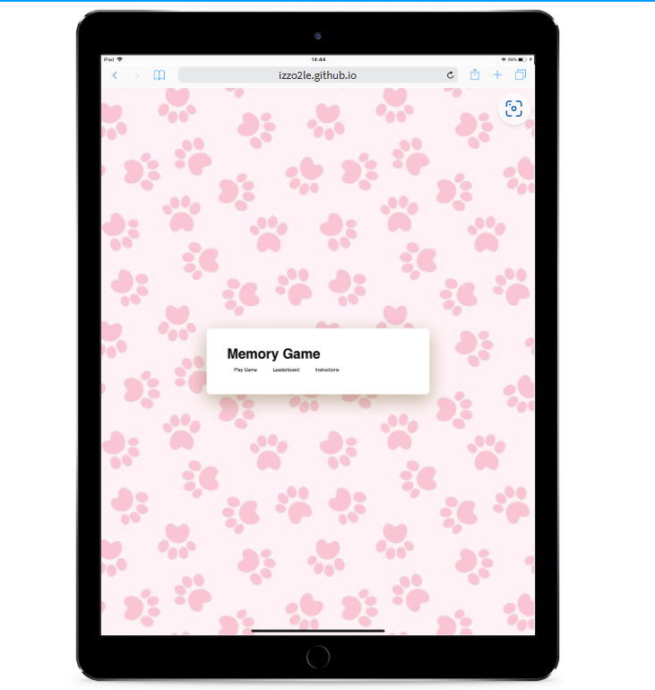
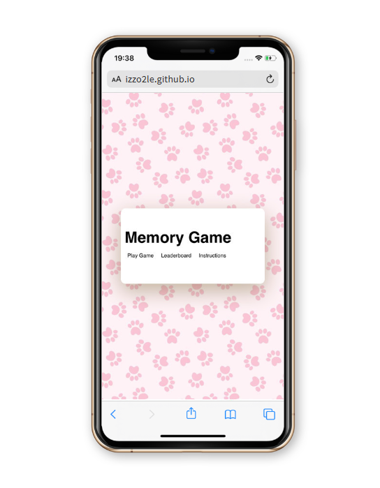

# **Izzo2le - Memory Game**

'Memory Game is a game which is designed to show how easily Javascript can be used when building a website. The website is targeted towards people of all ages and genders aswell as people who are wanting to understand concepts of javascript.

Memory Game is a responsive and interactive game where users will partner up 8 cards which match and can see how many attempts they had and how long it took them via the statistics and timer up in the top right corner. There isn't a maximum amount of attempts, users can play until they have matched all the pairs.

## **Table of contents**
1. [Planning Stage](#planning-stage)
1. [Features](#features)
1. [Testing](#testing)
1. [Deployment](#deployment)
1. [Technology Used](#technology-used)
1. [Credits](#credits)

## **Planning Stage**

### **Wireframe**
To begin my ‘Memory Game’ I created an initial plan, I drew out my layout and tried to stick to it as much as possible. There were some amendments which I made during the website review, which I felt created a better, easier experience for my users.

### **User Experience UX**

- As a user I wanted my game to be easy to use for all ages 
- As a user I wanted to have clear instructions before the game started so as theres  a clear idea of what was expected from the game 
= As a user I wanted the time and how many goes have been had, clearly shown above the game board.
- As a user I want to be able to see my final time and tries at the end of my game with a choice to play again.

### **Site Owner’s Aims**

- As the game creator I wanted to be able to create a fun and easy to follow game.
- As the game creator I wanted to show users a fun way to play the memory card game with the use of puppies.
- As the owner I wanted to create a easy to follow points system which shows the timer and how many goes the user has had to find each pair.
- As the owner I wanted to create a game which introduces people to JavaScript in a colourful exciting way. 

### **Colour Scheme**

I chose to go for a pink colour scheme due to it representing fun, liveliness and femininity. I aim for my website to be geared towards all genders but I wanted to introduce females to the idea of coding and how it is a universal language which can complement creativity..
I used a pink paw print background throughout my project which has a white background for the game area.

## **Features**  

In this section it will give details on my Memory game and it will explain the features and how they are achieved. 

### **Existing Features** 

- __The Score Area__

The score area is located right above my game cards, it allows the user to be able to see how many tries they have had already to locate all the pairs. I chose to have the game area shown here as it is easy to keep an eye on but not too bold to distract the user whilst they are playing. 

- __The Game Area__ 

This section allows the user to play my memory game. The cards are easily seen and have a timer of 3 seconds each to allow the users to be able to clearly see the image before it turns over again. The game board consists of 16 cards, containing 8 pairs of images to overturn. 
The user is then able to play the game by clicking on a card and then choosing another to match this card. If the card does not match, it will turn back over and allow the user to keep playing until all cards have been found. 

- __The Rules section__

The rules section tells the user how to play the game and a step by step to follow to achieve all the cards. With this being a user game, they do have the option after finishing the game to try achieve the cards in less tries, there is no limit on retries. The rules have been put on the first page before getting to the game page, in order to allow the user to see these before entering the game, this will allow them an idea of how the game is going to play. 

### **Features Left to Implement**

My memory game is currently just in its first stages, some features I would like to of added to increase the sites usability include:
Adding in different levels e.g easy, medium, hard; with this I could have changed the timing on how long the cards are turned over for so it works for different attention spans. 

## **Testing**

I have tested my website using dev tools. I also asked family members to test my website on their devices this was a mix of IOS and Android. (ANY ISSUES FOUND?) 

### **Functionality test** 

I made sure to test my website as I was going along, any errors which showed up, I would check over the code to correct and get it up and running again. 

#### **Implementation**:

This is to ensure the user understands the point of my page and how the game is meant to work. 

#### **Test**:  

I will be testing my website aswell as family and friends, this will be carried out by playing the game multiple times, double clicking, fast clicking on the cards so as I can detect any problems. 

#### **Did the buttons function correctly?** 

At the start of a new game the layout is all correct, the timer has started over and the scoreboard is showing ‘0’ moves made! So i made some changes and kept playing the game multiple times on multiple devices until i was able to fix the fault.

#### **Did the game play correctly?**

The first round of my memory game played successful, all the cards turned over for the same amount of time and then turned back unfolded. The correct pairs, paired.  I found through testing that after the first game the cards did glitch.

#### **Can the game be reset successfully?** 

Once the game is finished a page comes up to confirm the game is over, the finished time and how many goes the user played to get all pairs correctly. It allows the user to play again which takes them to play again. 

#### **Verdict:**  

The test passed with issues at first which I then corrected, it now runs efficiently to good standard. 

### **Responsiveness** 

Computer version 

This is my testing on chrome devices, however when testing on microsoft edge the screen faulted, the background didn't fill the screen and my buttons were unaligned.

Phone/tablet version 

### **Lighthouse**

All the pages of this project have been tested using lighthouse, all the pages achieved a score above 80, however my progressive web app didn’t do aswell due to not meeting the installability requirements. I feel through testing my site using lighthouse I have been able to see big improvements which will help both improve this website and improve my knowledge for future projects. 

- My SEO is the lowest scoring with 91 due to documents not having a meta description. 

### **Bugs/Fixes and Unfixed Bugs**

## **Deployment**

This game was deployed to GitHub pages, the steps on how I did this are:

Go to GitHub depositories and find ‘Memorygame’ navigate to the settings tab which is just above the green GitHub button.
Navigate down to the pages tab which is on the left hand side of the page.
Under the subheading ‘branch’ select from the ‘branch’ drop down menus click ‘main’ and then save.
Once you have selected the main branch, the page will automatically refresh and a subheading will appear to let you know the deployment was successful. 

### **Validator Testing** 

HTML - used https://validator.w3.org/nu/#textarea - the results came back saying there was no errors or warnings to show.

CSS - i used https://codebeautify.org/cssvalidate?utm_content=cmp-true it came back telling me i had some errors, these errors were to tell me that things weren't in alphabetical order, however if i did change this it would ruin my code and game altogether.

JAVASCRIPT - I used https://jshint.com/ to validate my Javascript code, it came back telling me there were  68 warnings, these consisted of 'const' being available on different lines.

## **Technology Used**

I used HTML, JavaScript and CSS3 to create my memory game. 

## **Credits**

### **Content**

Font - google fonts (find)
Colour scheme - https://icolorpalette.com/color/rose-pink
Started my game using the Love Maths tutorial on codeinstitute
Richard Wells - my coding tutor who helped me to understand JavaScript a bit better and helped my implement my ideas into a way I could create my game. Could not of completed this without him!
Used a YouTube video to help me build my game but implemented my own code and variation - https://youtu.be/dqqxkrKhfS4

### **Media** 

Images were sourced from friends and family’s dogs including my own. 
background for website - https://nr1iphonewalls.blogspot.com/2018/06/pink-paw-print-wallpaper-for-iphone-and.html